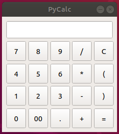
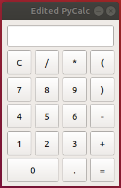

# PyQt5 izmēģinājums - PyCalc izskata pārkārtošana

Šīs nodarbības veikšanai es izmainīju internetā atrodama calculatora izkārtojumu.

Kalkulatora izkārtojumu pārveidoju līdzīgu tam, kas pieejams manā mobīlajā tālrunī, kurš manuprāt ir pārskatāmāks.
Kā arī uztaisīju, lai viena no pogām būtu divu pogu platumā.

## Kodā veiktās izmaiņas

### Pogu izkārtojums

Pogu atrašanās vieta un izveide tiek veikta ar cikla palīdzību, kas no saraksta nolasa pogas nosaukumu un atrašanās vietu.
Tādēļ, lai izmainītu pogu atrašanās vietu, jāizmaina ir šajā sarakstā piešķirtās vērtības.

Piemērs:
>        buttons = {
>            "7": (0, 0),
>            "8": (0, 1),
>            "9": (0, 2),
>            "/": (0, 3),
>            "C": (0, 4),
>            "4": (1, 0),
>            "5": (1, 1),
>            "6": (1, 2),
>            "*": (1, 3),
>            "(": (1, 4),
>            "1": (2, 0),
>            "2": (2, 1),
>            "3": (2, 2),
>            "-": (2, 3),
>            ")": (2, 4),
>            "0": (3, 0),
>            "00": (3, 1),
>            ".": (3, 2),
>            "+": (3, 3),
>            "=": (3, 4),
>        }

Izmainītais kods:
>        buttons = {
>            "C": (0, 0),
>            "/": (0, 1),
>            "*": (0, 2),
>            "(": (0, 3),
>            "7": (1, 0),
>            "8": (1, 1),
>            "9": (1, 2),
>            ")": (1, 3),
>            "4": (2, 0),
>            "5": (2, 1),
>            "6": (2, 2),
>            "-": (2, 3),
>            "1": (3, 0),
>            "2": (3, 1),
>            "3": (3, 2),
>            "+": (3, 3),
>            "0": (4, 0),
>            ".": (4, 2),
>            "=": (4, 3),
>        }

### Poga, kas ir divu pogu platumā

Šajā programmā pogām tiek piešķirts fiksēts izmērs, tāpēc, lai izveidotu pogu kas ir divu pogu platumā, bija nepieciešams ciklā ieviest izņēmumu, kura gadījumā pogai piešķirs citu izmēru

Ciklā ievietotā rindiņa:
>            if btnText=="0" :
>                self.buttons[btnText].setFixedSize(85, 40)

### Loga izmēri

Pa cik tika izmainīts pogu izkārtojums, jaunais pogu izkārtojums ar piešķirtajiem pogu izmēriem vairs logā nietilpst, tādēļ nepieciešams piešķirt jaunu izmēru.

Piemērs:
>        self.setFixedSize(235, 235)

Izmainītais kods:
>        self.setFixedSize(195, 275)

## Programmas darbība

Šis kalkulators strādā uz principa kad ievadīto simbolu virkni pārvērš par vienādojumu un mēģina to izpildīt.
Tādēļ, ja neievadīs darbību starp skaitli un iekavu ārpusi viņš izvadīs to kā kļūmi un ievadīto vienādojumu neizpildīs.

Ievadot simbolu virkni tiek pārbaudīts vai kāda no nospiestajām pogām neveic kādu no darbībām.
Piemērām nodzēšana 'C' vai arī vienādojuma izpildīšana '='
Ja nospiestā poga ir nav kāda no šiem izņēmumiem, tad ievadītais simbols tiek ievadīts un pievienots simbolu virknei.

