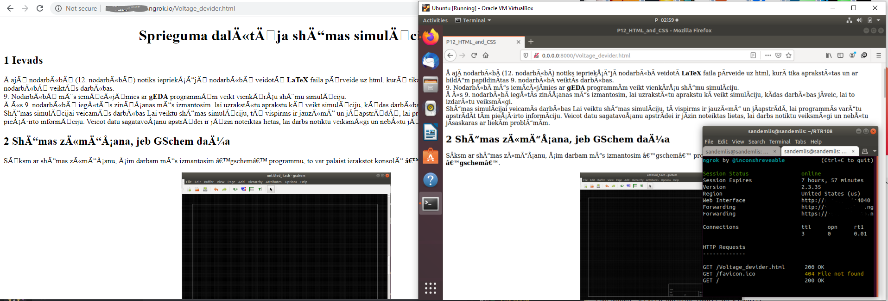

# SimpleHTTPServer web serviss

Palaišana
> python -m SimpleHTTPServer 8000

Palaižot serveri, tas tiks palaists pašreiz atvērtajā direktorijā un ja tajā nebūs index.html tas parādīs šīs direktorijas saturu.

ar ngrok šo palaisto serveri var atvērt attālināti.
ngrok rīks izveido tuneli pa kuru var piekļūt šim serverim.

Bildes kreisajā pusē var redzēt attālināti atvērto failu serverī (izmantojot ngrok palīdzību lai atvērtu ārpus VM)

Bildes labajā pusē var redzēt lokāli atvērto serveri VM un arī palaisto ngrok instanci.
