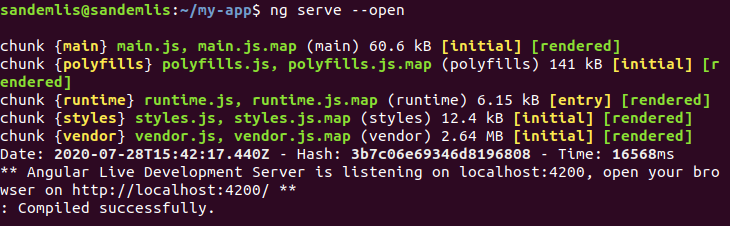
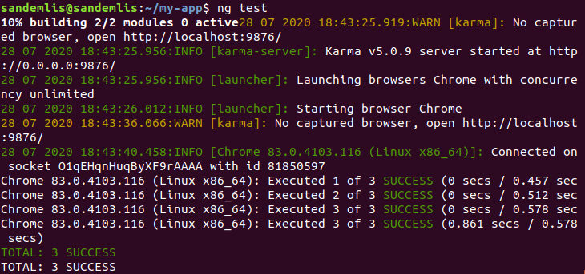
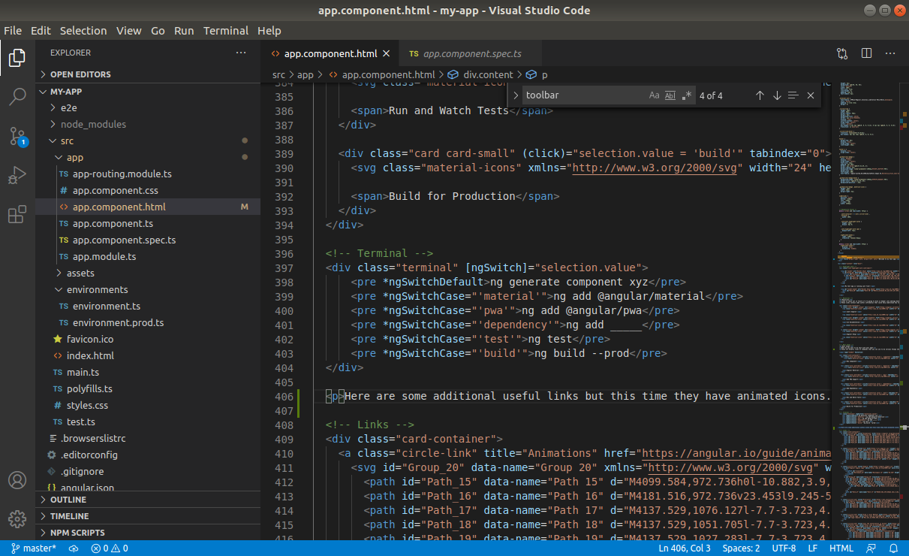
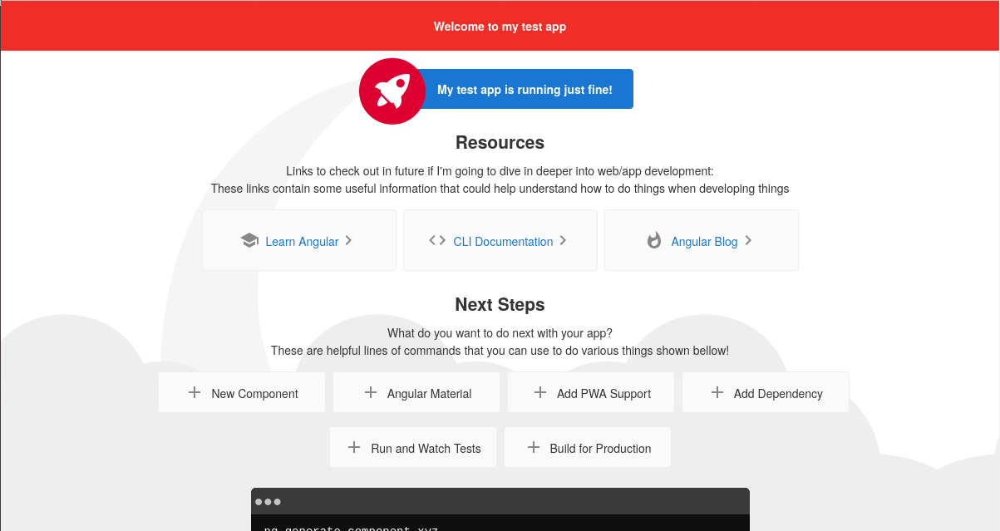

# Frameworks

Šajā nodarbībā notika iepazīšanās ar framework.
Notika lokāla Angular framework uzstādīšana un izmēģināšana kā notiek izmaiņas

Par uzstādīšanu es šajā darbā sīki neaprakstīšu, bet parādīšu rezultātu, ko framework piedāvā uz kā jau gatava piemēra, kas ir iespējams ar viņu darīt.

Lai izveidotu jaunu projektu virspirms jāieraksta komanda
> ng new [projekta nosaukums]

Tas pajautās kādu projekta stila valodu izmantosim no 4 variantiem
Šajā gadījumā es izvēlējos CSS

Jaunais projekts tiks izveidots jaunā mapē, tajā ieejot mēs varam palaist framework un sākt darbu ar to.

Komanda framework palaišanai:
> ng serve --open

Atribūts --open norāda lai palaistais projekts tiktu atvērts lokāli pārlūkprogrammā

Patinot lapu uz leju var redzēt ka tā piedāvā iztestēt to, cik ātra notiek tās darbība, to arī mēs izdarīsim

> ng test

Izpildot šo komandu palaižas jauns pārlūkprogrammas logs, kurā ar "Karma" servisa palīdzību tiek iztestēta lapas ātrdarbība.

Lai rediģētu kodu Frameworkā un redzētu veiktās izmaiņas tiek izmantots "Visual Studio Code", ko mēs saucam par workspace, jeb darba vidi

To palaist var ar komandu
> code .

Ievadot komandu atvērsies šāds logs

Visbeidzot ar šīs darba vides palīdzību es izmainīju lapas izskatu pamainots tās izskatu - izdzēšot lietas kas man nepatika, pārvietojot nosaukuma atrašanās vietu uz lapas vidus, pamainot dažas krāsas, kā arī papildinot uz lapas atrodamos tekstus.

## Svarīga piebilde

Šīs visas komandrindas tika izpildītas šī projekta starta direktorijā, ta tās tiek izpildītas ārpus tās, programma īsti nezinās ko palaist.
