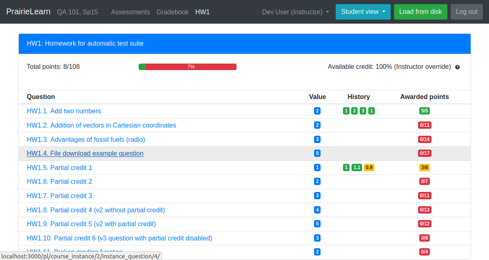
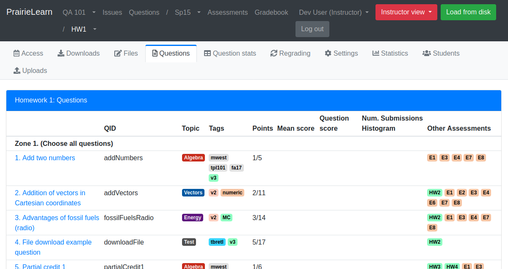
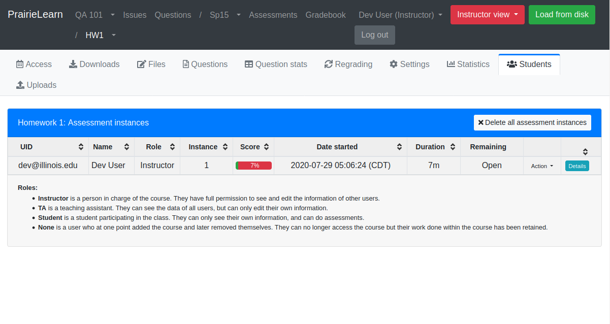
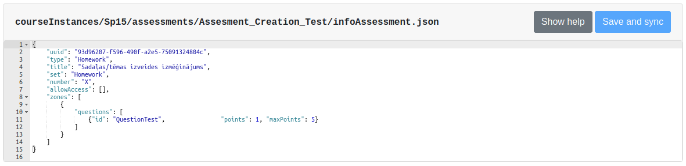
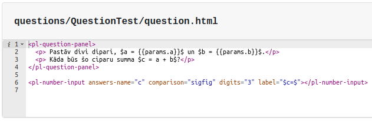
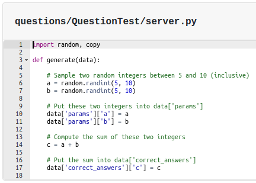
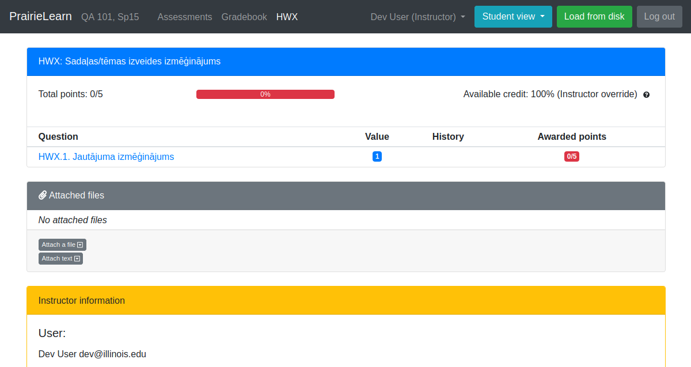
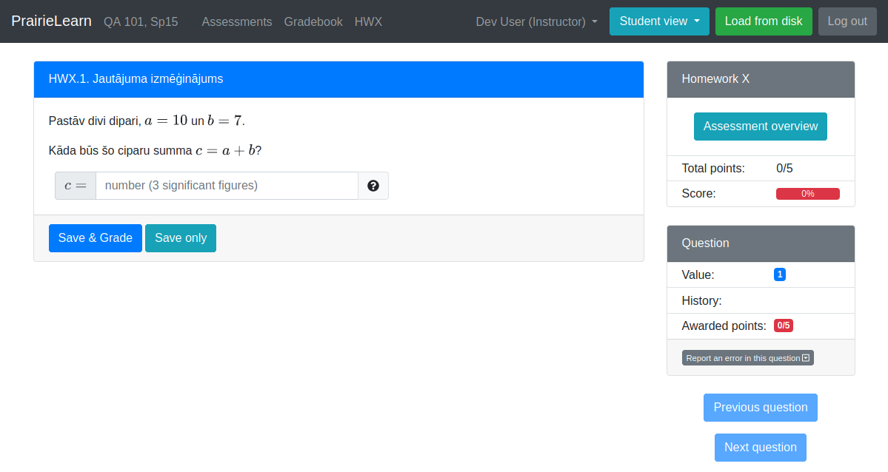
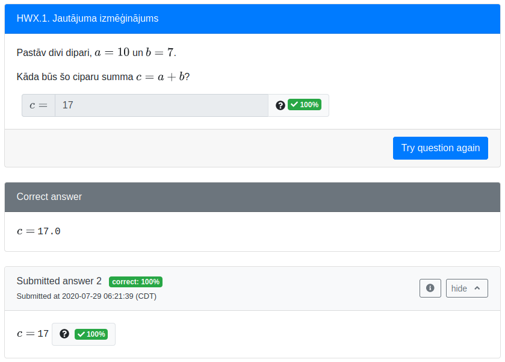

# PrairieLearn

Šajā nodarbībā notika ar PrairieLearn vides iepazīšanos.
Notika vides uzstādīšana lokāli, tika izveidota jauna sadaļa uzdevumiem, kā arī pievienots jauns izveidots uzdevums.

Pamācība kā uzstādīt vidi lokāli pieejama šajā mājaslapā:
https://prairielearn.readthedocs.io/en/latest/installing/

Kad vide ir uzstādīta un palaista, tai var piekļūt caur Localhost:3000

Jau uzreiz pieslēdzoties tev tiek piešķirts administrācijas konts ar kuru var veidot jaunas tēmas, jaunus jautājumus, testus un eksāmenus.

Tā ir papidināta ar dažādiem automatizētiem testēšanas veidiem kas pārbaudīs jautājumus/uzdevumus vairākas reizes ievadot tajos gan pareizas, gan nepareizas, kā arī nesaderīgas atbildes.

## Vides izskats

Kā administrators, tev ir iespēja redzēt vidi, kā to redzētu gan pasniedzējs, gan students.

Studentam:

Pasniedzējam:

Pasniedzējam galvenā īpašība ir, ka viņi var pārraudzīt kurās tēmās katrs no uzdevumiem ir piesaistīts.

Pasniedzēji var arī redzēt cik kurš students ir kopumā katru tēmu izpildījis procentuāli (Savākto punktu skaits pa visu tēmu)

Pagaidām pārskatā var redzēt tikai vienu cilvēku kuram, kā redzams ir izstrādātāja konts, tātad, katram cilvēkam, kurš šajā kursā konkrēto tēmu būs izmēģinājis varēs redzēt rezultātu apkopojumu - pat ja tas ir bijis tikai izmēģinājuma gaitā.

## Vidē jaunas tēmas un uzdevuma izveides izmēģinājums

Izveidojot jaunu tēmu, tiek sastapšanās ar tukšu tēmu kurā nav ievietoti nekādi uzdevumi, lai tai pievienotu uzdevumus ir nepieciešams rediģēt šīs tēmas izformācijas kodu.

Šajā kodā tika pievienots uzdevums, kurš jau tika izveidots iepriekš zem uzdevumu sadaļas.

Uzdevumi tāpat kā tēmas tiek uzģenerētas automātiski, tik pašiem ir jāizmaina uzdevumos redzamais teksts, kā arī uzdevuma kods, lai tas atbilstu uzdevuma vajadzībām.

Šajā failā es tekstu nomainīju, lai būtu latviski.

Šis fails satur uzdevuma kodu, tas nejaušības gaitā ģenerē ciparus no 5 līdz 10 ieskaitot un to summa pēctam tiek pārbaudīta ar lietotāja ievadīto skaitli.

Pa cik katru reizi tiek ģenerēti jauni uzdevuma parametri tas atvieglo variantu izveidi, kas nozīmē, ka būs pieejami tik daudz varianti, cik to atļaus iestatītais intervāls skaitļu ģeneratoram.

Šī faila saturu es nemainīju.

### Izveidotās tēmas un uzdevuma izskats

Izveidotajā tēmā tika pievienots tikai viens uzdevums.

Atverot jautājumu mēs redzēsim izveidoto uzdevumu, kurš nu jau ir latviešu valodā.

Kā arī, atbildot uz uzdevumu, var redzēt, ka tas strādā veiksmīgi un atbilde ir pieņemta.

## Pirmais iespaids

Pirmajā iespaidā šī vide mazliet atgādina Moodle vidi. Lai gan es iepriekš neesmu ar šādu vidi strādājis un veidojis uzdevumus, man tas lielas grūtības nesagādāja, jo pārskatot jau pieejamās tēmas, kas tiek izveidotas automātiski, var saprast, kā izveidot jaunu.
