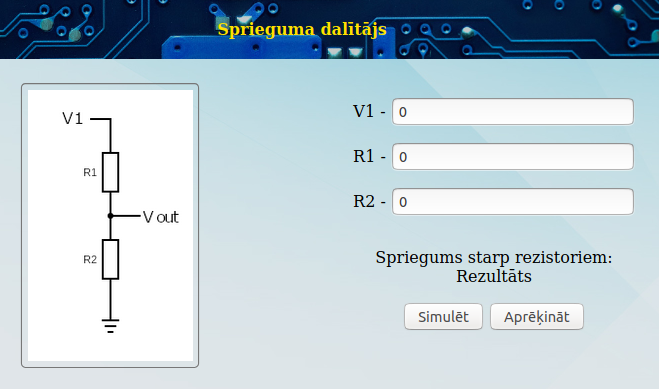
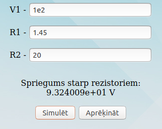
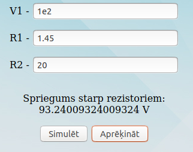
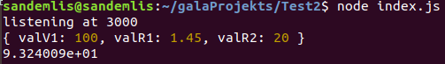
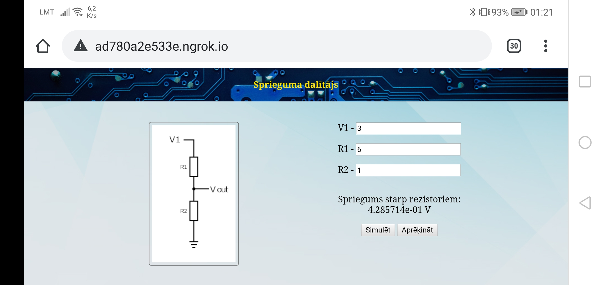

# Gala projekts sprieguma dalītāja web-service

Gala darbam šajā mācību kursā bija jauztaisa web-serviss sprieguma dalītājam.

Šim nolūkam, lai izveidotu serveri, uz kura iet mājaslapa, es izmantoju Node JS un Express

Sprieguma dalītāja rezultāta iegūšanai tiek pedāvāti divi varianti Simulējot shēmi vai arī aprēķinot izmantojot sprieguma dalītāja formulu.

Simulācijai:

Aprēķinam:

Saziņa starp lietotāju un serveri notiek ar JSON palīdzību
Nosūtītie dati serverim tiek izvadīti konsolē, tie tiek saglabāti failā un tiek veikta simulācija, pēc kuras rezultāti tiek nolasīti, izdavīti konsolē un nosūtīti lietotājam.

Kā arī tika iztestēta mājaslapas darbība uz ārējās ierīces.

## Izlabotās problēmas

Sākotnēji, ja serverim pārāk strauji pieprasītu vairākas reizes veikt simulāciju, tas pārtrauca strādāt, jo serveris mēģināja veikt simulāciju reize kad tika ierakstīts simulācijai nepieciešamis fails.
Šī problēma tagad ir izlabota (var sūtīt cik daudz pieprasījumus grib), tik tagad, ja ir notikusi kļūma un simulācija nav bijusi veiksmīga, lietotājs simulācijas rezultātu nesaņem.

## Citas lietas pie kurām būtu nepieciešams piestrādāt.

Ja pārlūkprogrammas logs, vai arī ierīces ekrāns ir šaurs, saturs netiek attēlots pareizi un var pārklāties ar sprieguma dalītāja shēmas bildi.

### Piebilde

Šajā gadījumā simulācijas veikšana lokāli serverī nebija pat nepieciešama, jo, kā jau tas parādīts lapā, sprieguma dalītāja rezultātu var iegūt arī caur formulu ar scriptu palīdzību.
Bet, veicot sprieguma simulāciju lokāli, es iemācījos daudz vairāk par serveru darbību kā būtu, ja tikai būtu izmantojis šo dalītāja formulu.
